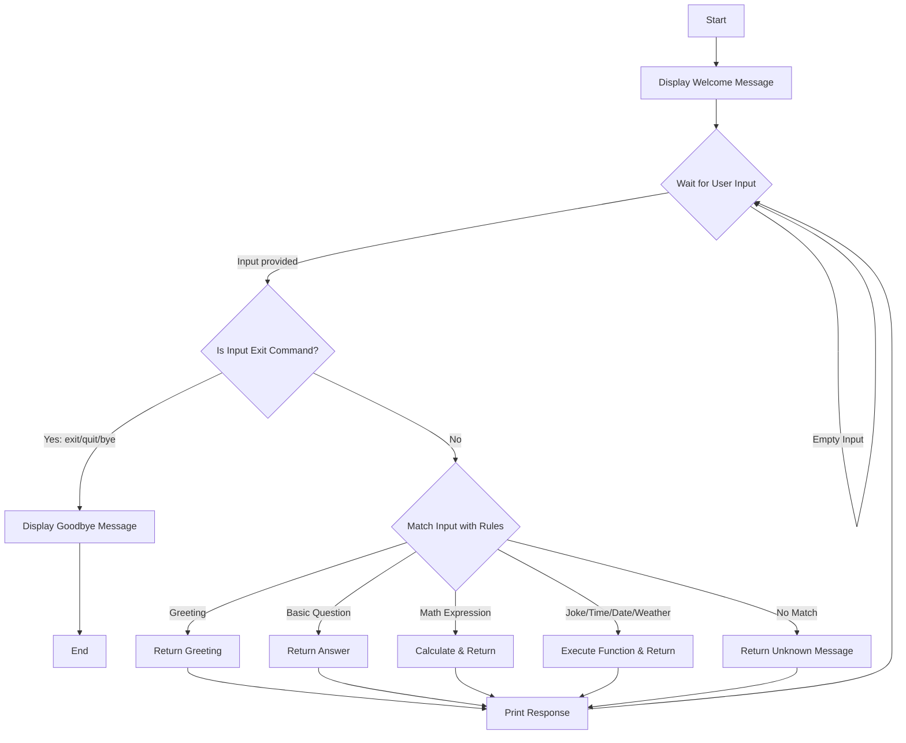

# RuleBot - Beginner-Friendly Rule-Based AI Chatbot

A simple, rule-based chatbot created in Python. This project is ideal for beginners to learn about basic programming concepts such as variables, strings, loops, conditionals, and functions, without requiring any complex Machine Learning libraries.

## Features

### Required Features
- **Greeting Detection**: Understands various greetings (Hi, Hello, Hey, Good Morning, Good Evening).
- **Basic Questions**: Can answer questions like "What is your name?", "Who created you?", "How are you?", and "What can you do?".
- **Exit Commands**: Recognizes exit commands to gracefully end the chat (exit, quit, bye, goodbye).
- **Unknown Input Handling**: Fallback message for unrecognized input.
- **Continuous Conversation**: Utilizes a `while True` loop to keep the bot running until the user decides to exit.

### Optional Features
- **Tell jokes**: Replies with a random programming joke.
- **Show current date**: Uses the `datetime` module to display the current date.
- **Show current time**: Uses the `datetime` module to display the current time.
- **Simple calculator**: Performs basic math operations securely using regex filtering.
- **Weather placeholder**: A simulated weather response.
- **Easy-to-read menu**: Provides a list of available commands.

## Folder Structure

```
rulebot/
│
├── chatbot.py           # The main Python script containing the bot logic
├── README.md            # Project documentation (this file)
└── requirements.txt     # Python dependencies (empty for this project)
```

## Flowchart



## Working Explanation

1.  **Imports**: The script uses built-in Python modules (`datetime`, `random`, `re`, `sys`). No external libraries are needed.
2.  **Helper Functions**: Small, specialized functions handle specific tasks like getting the time (`get_current_time()`), telling a joke (`get_joke()`), or doing math (`calculate(expression)`).
3.  **`get_response()` Function**: This is the core logic. It takes the user's input, standardizes it (lowercase and stripped of extra spaces), and runs it through a series of `if-elif-else` rules to determine the best response.
4.  **`main()` Function**: This sets up the `while True` loop for continuous conversation. It takes the user's input, checks for exit commands, calls `get_response()`, and prints the result. It also handles empty inputs and graceful exits on `Ctrl+C`.

## Sample Output

```
========================================
Welcome to RuleBot! (Type 'help' for options)
========================================

You: hello
RuleBot: Hello there! How can I help you today?

You: what is your name?
RuleBot: I am RuleBot, your friendly assistant.

You: help
RuleBot:
    Here is what I can do:
    1. Answer basic questions (e.g., 'What is your name?', 'How are you?')
    2. Tell a joke (say 'tell me a joke')
    3. Show time and date (say 'time' or 'date')
    4. Calculate simple math (say 'calculate 5+5')
    5. Check weather (say 'weather')
    6. Exit (say 'exit', 'quit', 'bye')

You: calculate 10 * 5
RuleBot: The result is 50

You: time
RuleBot: The current time is 09:30 PM.

You: sdfghj
RuleBot: I'm sorry, I don't understand that. Type 'help' to see what I can do.

You: exit
RuleBot: Goodbye! Have a great day!
```

## Future Improvements

-   **API Integration**: Connect to a real weather API (like OpenWeatherMap) instead of using a placeholder.
-   **Regex Expansion**: Use Regular Expressions for more flexible natural language understanding (e.g., catching variations like "what's the time" or "tell me the time please").
-   **Conversation Memory**: Store previous inputs in variables or a list to allow for context-aware responses (e.g., asking "What is your favorite color?" and then later referring to it).
-   **GUI Application**: Wrap the logic in a graphical user interface using Tkinter or PyQt instead of using the command line.
-   **Machine Learning**: Eventually upgrade the bot to use NLP libraries (like NLTK or SpaCy) or LLM APIs to handle complex, unpredictable inputs.

---
*This project was created as a beginner-friendly Python demonstration.*
